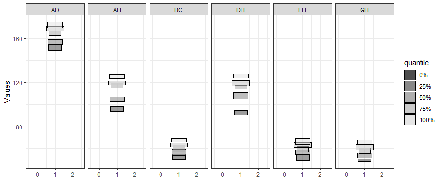
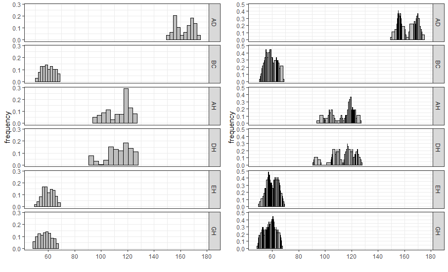
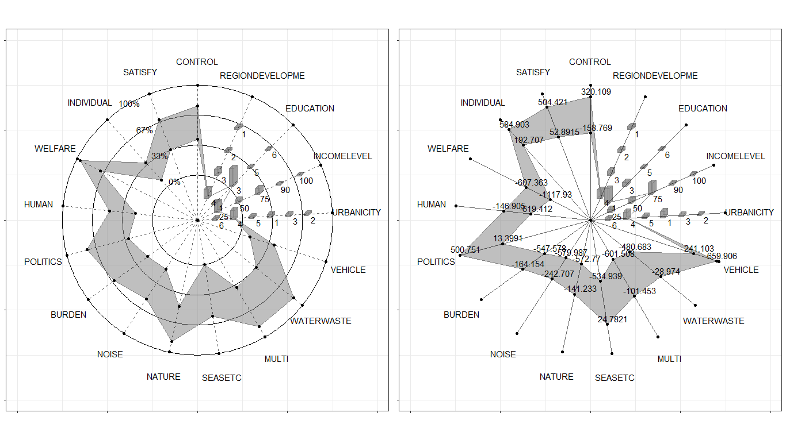
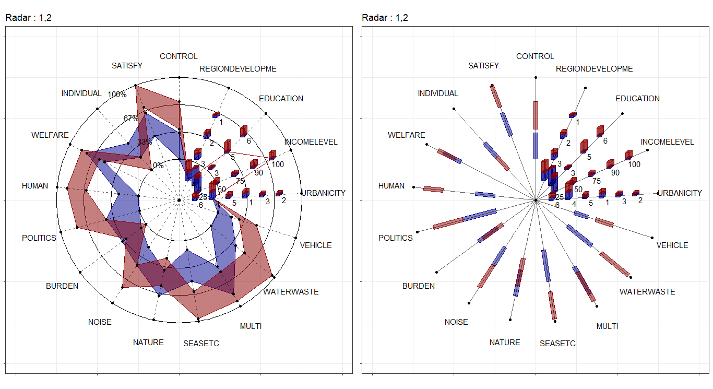

# ggESDA : An R package for Exploratory Symbolic data analysis

Symbolic data analysis (SDA) is an extension of standard data analysis where symbolic data tables are used as input and symbolic objects are made output as a result. The data units are called symbolic since they are more complex than standard ones, as they not only contain values or categories, but also include internal variation and structure.<a href="#ref1">[1]</a><a href="#ref2">[2]</a>

<b>ggESDA</b> is an extension of ggplot2 for visualizing the symbolic data based on exploratory data analysis (EDA). The package contains many useful graphic techniques functions. Furthermore, the users can also transform the classical data into the symbolic data by the function in this package, which is one of the most important processing in SDA. For the details of the package study, you can see in <a href="https://github.com/kiangkiangkiang/RESEARCH/blob/master/ggESDA_Jiang%26Wu_20210915.pdf">Jiang (2022)</a>.

## Package installation

It is recommended that download the package on CRAN, although the latest version is always upload to github first. The version in github may exist some bugs that are not fix completely.

### CRAN (Update in 2022-01-10)

The <b>ggESDA</b> package is avaliable on <a href="https://cran.r-project.org/web/packages/ggESDA/index.html">CRAN</a>. The Reference manual and Vignettes can be found there.

`install.packages("ggESDA")`

or 

### github (Update in 2022-01-25)

`devtools::install_github("kiangkiangkiang/ggESDA")`

After installation, the following steps will illustrate how to use the package. More details (code) about it can be found on <a href="https://cran.r-project.org/web/packages/ggESDA/vignettes/ggESDA.html">vignettes</a>.

## Creating

The example data is called <b>facedata</b> </a><a href="#ref3">[3]</a>. It will be the interval form with minimal and maximal, known as <b>interval-valued</b> data. However, most of the symbolic data are not exist at the beginning. Instead, they are usually aggregated by clustering algorithm from a classical data. Thus, we will use `classic2sym()` function to summarize classical data into symbolic data.


```{r library}
library(ggESDA)
```

```{r createData}
#aggregated by the variable Species in iris
iris_interval_var <- classic2sym(iris, groupby = Species)
iris_interval_kmeans <- classic2sym(iris, groupby = "kmeans")
iris_interval_hclust <- classic2sym(iris, groupby = "hclust")

d <- data.frame(minData = runif(100, 0, 10),
                maxData = runif(100, 50, 60))
                

d.sym <- classic2sym(d, groupby = "customize",
                    minData = d$minData,
                    maxData = d$maxData)
                    
#get interval-valued data
d.sym$intervalData
```

## Visualization

With the symbolic data generated, you can start to visualize the data by the following functions:

### ggInterval_index() for visualizing the interval of each observations


</img>

```{r ggInterval_index,eval=FALSE}
# get the mean value for the hline
m <- mean(facedata$AD)

# build a color mapping for each person
Concepts <- as.factor(rep(c("FRA", "HUS", "INC", "ISA", "JPL", "KHA",
                            "LOT", "PHI", "ROM"), each = 3))
                            
# start plot
ggInterval_index(facedata, aes(x = AD, fill = Concepts))+
  theme_bw() +
  scale_fill_brewer(palette = "Set2")+
  geom_segment(x = m, xend = m, y = 0, yend = 27,
               lty = 2, col = "red", lwd = 1) +
  geom_text(aes(x = m, y = 28), label = "Mean")+
  scale_y_continuous(breaks = 1:27,
                     labels = rownames(facedata))
                     
```
It can get the preliminary understanding of the interval-valued data. 

You can also change `fill =` and `col =` to make the plot more visible, and set x or y axis to your variable will rotate the index line in figure.

### ggInterval_minmax() for visualizing the interval of each observations which is sorted by minimal value

```{r ggInterval_minmax,eval=FALSE}
ggInterval_minmax(data = NULL, mapping = aes(NULL), scaleXY = "local", plotAll = F)
```
MMplot is an advanced graphics implemented for symbolic data, or interval-valued data. It presents the interval by the minimum and maximum, and shows the difference between each location of concept in each variable through the 45-degree line. The options `scaleXY = "local"` will define the axis limit for the comparsion.

### ggInterval_boxplot() for visualizing the distribution of the interval data

```{r ggInterval_boxplot,eval=FALSE}
ggInterval_boxplot(facedata, plotAll = T) + theme_bw()
```
</img>

The side-by-side boxplot clearly shows the difference of variables' distribution.

### ggInterval_hist() for visualizing the distribution of the interval data

For interval-valued data, not only equidistant-bin histogram but the Non-equidistant-bin histogram will exhibit the distribution. Use the option `method`, and set by `equal-bin` or `unequal-bin`. See the details <a href="https://github.com/kiangkiangkiang/RESEARCH/blob/master/ggESDA_Jiang%26Wu_20210915.pdf">Jiang (2022)</a>.

```{r ggInterval_hist,eval=FALSE}
equal_bin <- ggInterval_hist(facedata, plotAll = T) +
              theme_bw()
unequal_bin <- ggInterval_hist(facedata, plotAll = T,
                               method = "unequal-bin") +
              theme_bw()
ggarrange(equal_bin, unequal_bin, ncol = 2)  
```
</img>

### ggInterval_centerRange for visualizing the relation between center and range of the interval of each observations.

```{r ggInterval_minmax,eval=FALSE}
ggInterval_centerRange(data = NULL, mapping = aes(NULL), plotAll = F)
```
Another advanced graphics implemented is called center-range plot, which helps researchers to be able to grasp the relationship between center and range.

### ggInterval_scatter for visualizing the the relation of two variables

A scatter plot of interval-valued data is presented by a rectangle, which is composed of two interval.

As well, ggInterval_scaMatrix is an extension for visualizing all variables relations by using scatter plot at a time.

```{r ggInterval_minmax,eval=FALSE}
ggInterval_scaMatrix(facedata)
```
</img>


### ggInterval_2Dhist for visualizing the two variable distribution by theirs frequency of interval bins

Another bivariate relationship plot is two-dimension histogram, which is to calculate joint
histogram frequency and using matrix visualization to plot.

By the extension, ggInterval_2DhistMatrix is to visualize all variables relations by using 2Dhist plot at a time

```{r ggInterval_2DhistMatrix,eval=FALSE}
ggInterval_2DhistMatrix(facedata,
                        xBins = 10,
                        yBins = 10,
                        removeZero = T,
                        addFreq = F)
```

</img>

### ggInterval_indexImage for visualizing the interval of each observations by using image

A heatmap type presentation for the interval by the option `plotAll` and `full_strip`. There will be two distinct type, column condition and matrix condition.  See the details <a href="https://github.com/kiangkiangkiang/RESEARCH/blob/master/ggESDA_Jiang%26Wu_20210915.pdf">Jiang (2022)</a>.

```{r ggInterval_indexImage2,eval=FALSE}
p1 <- ggInterval_indexImage(facedata, plotAll = T, column_condition = T,
                      full_strip = T)

p2 <- ggInterval_indexImage(facedata, plotAll = T, column_condition = F,
                      full_strip = T)

ggpubr::ggarrange(p1, p2, ncol = 2)

```

</img>

### ggInterval_radar for visualizing the interval of multivariates

One of the most well-known multivariate visualization techniques is radar plot, or called start plot. We fill the interval area by color mapping, and compare CONCEPTs, surely you can arrange it.

In `ggInterval_radar`, you can add any annotations in figure, including a circle for classify the normalize data position, a real value for the interval or a propotion for modal multi-valued variables. There is the most important options `plotPartial`, which define which observations you want to plot. For example, `ggInterval_radar(data = facedata, plotPartial = c(1, 3))`. It means we want to plot the observations whose position of row is at 1 and 3. Remark: A radar plot will visualize all variables you on your input data in one time. If you only want to show the partial variables, just clarify in your input data, ex `data = facedata[, 1:3]`. However, the data you input must have full observations in order to normalize, so an obvious ERROR for input options in data is a `data = facedata[1:5, ]`, which only contains the first five data not a full. Unless you want to make them be your population.

</img>

Surely, we always compare the data in the same figure. Just use the color mapping for the different observations.

</img>

In the field of interval-valued data, the quantile is usually for analysis. We can present the quantiles for each datasets.

</img>


### ggInterval_PCA for dimension reduction in interval data

Two kinds of dimension reduction,  see the details <a href="https://github.com/kiangkiangkiang/RESEARCH/blob/master/ggESDA_Jiang%26Wu_20210915.pdf">Jiang (2022)</a>, show in following:

```{r ggInterval_radar2,eval=FALSE}
CONCEPT <- rep(c("FRA", "HUS", "INC", "ISA", "JPL", "KHA",
           "LOT", "PHI", "ROM"), each = 3)
p <- ggInterval_PCA(facedata, poly = T,
                    concepts_group = CONCEPT)
p$ggplotPCA <- p$ggplotPCA + theme(legend.position = "top") + 
  theme_bw() 

p2 <- ggInterval_PCA(facedata, poly = F,
                    concepts_group = CONCEPT)
p2$ggplotPCA <- p2$ggplotPCA + theme(legend.position = "top") +
  theme_bw()

ggpubr::ggarrange(p$ggplotPCA, p2$ggplotPCA, ncol = 2)
```

</img>


## References
<p id="ref1">
1. Diday, Edwin; Esposito, Floriana (December 2003). "An introduction to symbolic data analysis and the SODAS software".
</p>

<p id="ref2">
2. Lynne Billard; Edwin Diday (14 May 2012). Symbolic Data Analysis: Conceptual Statistics and Data Mining.
</p>

<p id="ref3">
 3. Billard L. and Diday E. (2006). Symbolic data analysis: Conceptual statistics and data mining. Wiley, Chichester.
 </p>
 

