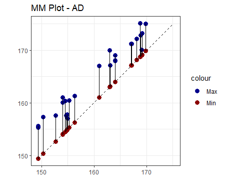
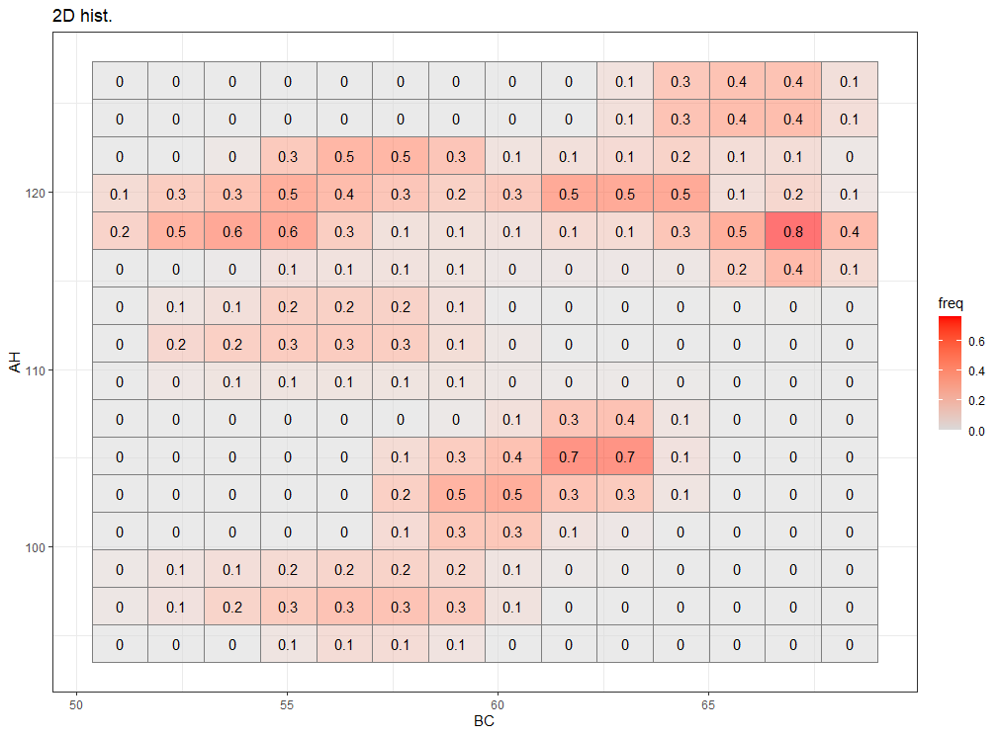
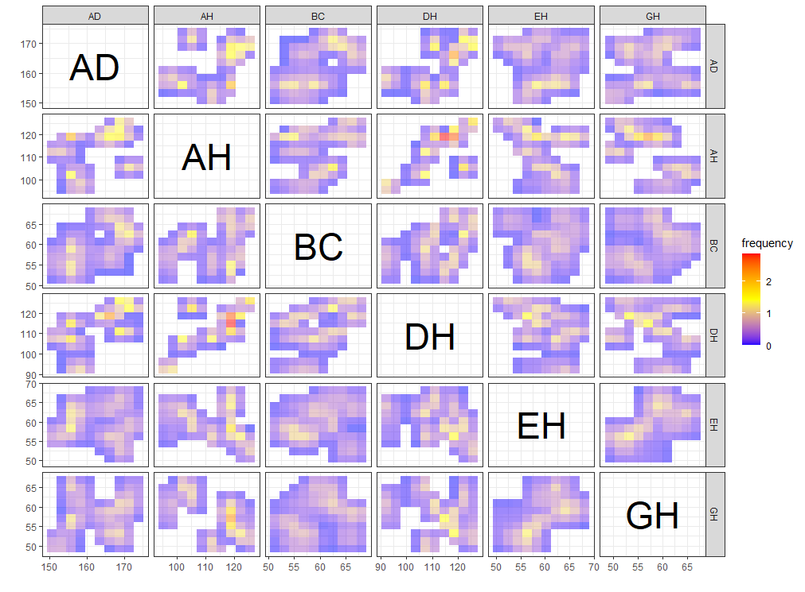

```{r, include = FALSE}
knitr::opts_chunk$set(
  collapse = TRUE,
  comment = "#>"
)
```

Symbolic data analysis (SDA) is an extension of standard data analysis where symbolic data tables are used as input and symbolic objects are made output as a result. The data units are called symbolic since they are more complex than standard ones, as they not only contain values or categories, but also include internal variation and structure.<a href="#ref1">[1]</a><a href="#ref2">[2]</a>

<b>ggESDA</b> is an extension of ggplot2 for visualizing the symbolic data based on exploratory data analysis (EDA).The package contains many useful functions for exploratory plots.Furthermore,the users can also transform the classical data into the symbolic data by the function in this package.

## Package installation
~~~skip~~~

## Creating

The example data is called "facedata" which is from RSDA package.It will be the interval form with minimal and maximal.However,most of the symbolic data are not exist at the beginning.Instead,they are usually aggregated by clustering method from a classical data.Thus,we will use `classic2sym()` function to transform classical data into symbolic data as the second example data.

```{r setup, include=FALSE}
knitr::opts_chunk$set(echo = TRUE)
knitr::opts_chunk$set(warning=FALSE)
knitr::opts_chunk$set(message=FALSE)
knitr::opts_chunk$set(out.width = "100%")
knitr::opts_chunk$set(fig.align = 'center')

library(knitr)
```

```{r library}
library(ggESDA)
```

```{r createData}
#aggregated by the variable Species in iris
iris_interval<-classic2sym(iris,groupby = Species)$intervalData
iris_interval
class(iris_interval)
dim(iris_interval)

myFacedata<-RSDA::facedata
head(myFacedata,5)
class(myFacedata)
dim(myFacedata)
```

## Visualization

With the symbolic data generated,you can start to visualize the data by the following functions:

### ggInterval_index() for visualizing the interval of each observations

```{r ggInterval_index,eval=FALSE}
ggInterval_index(data=iris_interval,aes(x=1:3,y=Sepal.Length))
```
```{r, echo=FALSE}
include_graphics("images/ggInterval_index.png")
```

You can also change `fill=` and `col=` to make the plot more visible,and set x or y axis to your variable will rotate the index line in figure.

```{r ggInterval_index2,eval=FALSE}
ggInterval_index(data=myFacedata,aes(x=AD,col="red",fill=5))
```
```{r, echo=FALSE}
include_graphics("images/ggInterval_index2.png")
```


### ggInterval_minmax() for visualizing the interval of each observations which is sorted by minimal value

```{r ggInterval_minmax,eval=FALSE}
ggInterval_minmax(iris_interval,aes(x=Petal.Length))
```
```{r, echo=FALSE}

```

```{r ggInterval_minmax2,eval=FALSE}
ggInterval_minmax(myFacedata[16:21,],aes(x=AD))+
  coord_flip()
```
```{r, echo=FALSE}
include_graphics("images/ggInterval_minmax2.png")
```

### ggInterval_boxplot() for visualizing the distribution of the interval data

The width of rectangle in boxplot is not meaningful.Instead,it is 
used for showing the difference of each quantile,either is the fill color.

```{r ggInterval_boxplot,eval=FALSE}
ggInterval_boxplot(iris_interval,aes(x=Petal.Length))
```
```{r, echo=FALSE}
include_graphics("images/ggInterval_boxplot.png")
```

You can also change the fill color and any aesthetic to which you like.

```{r ggInterval_boxplot2,eval=FALSE}
ggInterval_boxplot(data=myFacedata,aes(x=AD,col="black",lty=2,lwd=1.2))+
  scale_fill_manual(values = c("red","yellow",
                               "green","blue","grey"),
                    labels=c("0%","25%","50%","75%","100%"),
                    name="quantile")
```
```{r, echo=FALSE}

```

### ggInterval_hist() for visualizing the distribution of the interval data

The histogram of interval data is to calculate the frequency of each interval in bins,and in `ggInterval_hist()` function,there are two main parameter can be adjusted by user.One is the `bins`,just like the geom_histogram do,and the default of bins is 10.The other is the `method`,`equal-bin` and `inequal-bin` can be chosen,and the default of method is `equal-bin`.

* equal-bin method (default)

```{r ggInterval_hist,eval=FALSE}
ggInterval_hist(iris_interval,aes(x=Sepal.Width,col="red",fill="green"),bins = 30,method="equal-bin")+
  coord_flip()
```
```{r, echo=FALSE}
include_graphics("images/ggInterval_hist.png")
```

* inequal-bin method 

Note : The change of bins in this method will be ignore because it will conflict with algorithm .

```{r ggInterval_hist2,eval=FALSE}
ggInterval_hist(data=myFacedata[10:16,],aes(x=AH),
                method="inequal-bin")
```
```{r, echo=FALSE}
include_graphics("images/ggInterval_hist2.png")
```

### ggInterval_centerRange for visualizing the relation between center and range of the interval of each observations.

```{r ggInterval_centerRange,eval=FALSE}
ggInterval_centerRange(iris_interval,aes(x=Sepal.Width))+
  geom_text(label=rownames(iris_interval),vjust=-0.8)+
  scale_x_continuous(limits = c(2.6,3.4))+
  scale_y_continuous(limits = c(1.3,2.2))
```
```{r, echo=FALSE}
include_graphics("images/ggInterval_centerRange.png")
```

```{r ggInterval_centerRange2,eval=FALSE}
ggInterval_centerRange(myFacedata[11:20,],aes(x=GH))+
  geom_text(label=rownames(myFacedata)[11:20],vjust=-0.8,size=3)
```
```{r, echo=FALSE}
include_graphics("images/ggInterval_centerRange2.png")
```

### ggInterval_scatter for visualizing the the relation of two variables

Because the value is an interval,it will be a nice way that the rectangle represents interval of two variables.

```{r ggInterval_scatter,eval=FALSE}
ggInterval_scatter(iris_interval,aes(x=Petal.Length,y=Petal.Width))+
  scale_x_continuous(limits = c(0.3,7))
```
```{r, echo=FALSE}
include_graphics("images/ggInterval_scatter.png")
```


```{r ggInterval_scatter2,eval=FALSE}
ggInterval_scatter(myFacedata[10:20,],aes(x=AD,y=AH))+
  guides(fill=F)
```
```{r, echo=FALSE}
include_graphics("images/ggInterval_scatter2.png")
```

### ggInterval_scaMatrix for visualizing all variables relations by using scatter plot at a time

```{r ggInterval_scaMatrix,eval=FALSE}
ggInterval_scaMatrix(iris_interval[, c(1:3)],
                     aes(
                       col = "red",
                       lty = 2 ,
                       fill = "blue",
                       alpha = 0.3
                     ))
```
```{r, echo=FALSE}
include_graphics("images/ggInterval_scaMatrix.png")
```

### ggInterval_2Dhist for visualizing the two variable distribution by theirs frequency of interval bins

```{r ggInterval_2Dhist,eval=FALSE}
ggInterval_2Dhist(iris_interval, aes(x = Sepal.Length, y = Petal.Length))
```
```{r, echo=FALSE}
include_graphics("images/ggInterval_2Dhist.png")
```

It can be adjusted by ggplot2 function too.Using `?ggInterval_2Dhist()` will show more detail about it. 

```{r ggInterval_2Dhist2,eval=FALSE}
ggInterval_2Dhist(myFacedata, aes(x = AD, y = AH)) +
  scale_fill_gradient2(
    low = "green",
    mid = "grey",
    high = "red",
    midpoint = 0.3
  )
```
```{r, echo=FALSE}

```

### ggInterval_2DhistMatrix for visualizing all variables relations by using 2Dhist plot at a time

Note : It isn't recommended to deal with too many variables because the time complexity in calculating full matrix will be too large. 

```{r ggInterval_2DhistMatrix,eval=FALSE}
ggInterval_2DhistMatrix(iris_interval)
```
```{r, echo=FALSE}

```

### ggInterval_indexImage for visualizing the interval of each observations by using image

```{r ggInterval_indexImage,eval=FALSE}
ggInterval_indexImage(iris_interval, aes(x = Sepal.Length))

```
```{r, echo=FALSE}
include_graphics("images/ggInterval_indexImage.png")
```

```{r ggInterval_indexImage2,eval=FALSE}
ggInterval_indexImage(myFacedata,
                      aes(x = AD),
                      column_condition = TRUE,
                      full_strip = TRUE) + coord_flip() +
  theme(axis.text = element_text(size = 5))

```
```{r, echo=FALSE}
include_graphics("images/ggInterval_indexImage2.png")
```

### ggInterval_3Dscatter for visualizing the relation of three variables

```{r ggInterval_3Dscatter,eval=FALSE}
ggInterval_3Dscatter(iris_interval, aes(Sepal.Length, Petal.Length, Petal.Width))
```
```{r, echo=FALSE}

```

If variance is too large(or small) or the difference between two variables are too large,it will be distortion or unidentifiable,which may happen in different units or others.

So,a standardizing way is necessary by using `scale = TRUE`.

```{r ggInterval_3Dscatter2,eval=FALSE}
ggInterval_3Dscatter(myFacedata[1:8, ], aes(AD, BC, AH), scale = TRUE)
```
```{r, echo=FALSE}

```

### ggInterval_radar for visualizing the interval of multivariates

```{r ggInterval_radar,eval=FALSE}
ggInterval_radar(iris_interval,inOneFig = TRUE)
```
```{r, echo=FALSE}
include_graphics("images/ggInterval_radar.png")
```

It can also plot partial observations by `plotPartial = `,and the right hand of equation can put the row index of observations you want to see.

```{r ggInterval_radar2,eval=FALSE}
ggInterval_radar(myFacedata,layerNumber = 6,plotPartial = c(1:4))
```

```{r, echo=FALSE}
include_graphics("images/ggInterval_radar2.png")
```

### ggInterval_PCA for dimension reduction in interval data

* The scatter plot of first two principal component 

```{r ggInterval_PCA,fig.show='hide'}
myPCA<-ggInterval_PCA(myFacedata,aes(fill="grey"),plot = FALSE)
myPCA$ggplotPCA
```
```{r, echo=FALSE}
include_graphics("images/ggInterval_PCA.png")
```

* PCA loading

```{r pcaLoadings}
myPCA$loadings
```

* PCA contribution

```{r}
cumsum(myPCA$sdev/sum(myPCA$sdev))
```

* PCA first three scores by interval
```{r}
head(myPCA$scores_interval[,1:3])
```

## References
<p id="ref1">
1. Diday, Edwin; Esposito, Floriana (December 2003). "An introduction to symbolic data analysis and the SODAS software".
</p>

<p id="ref2">
2. Lynne Billard; Edwin Diday (14 May 2012). Symbolic Data Analysis: Conceptual Statistics and Data Mining.
</p>


